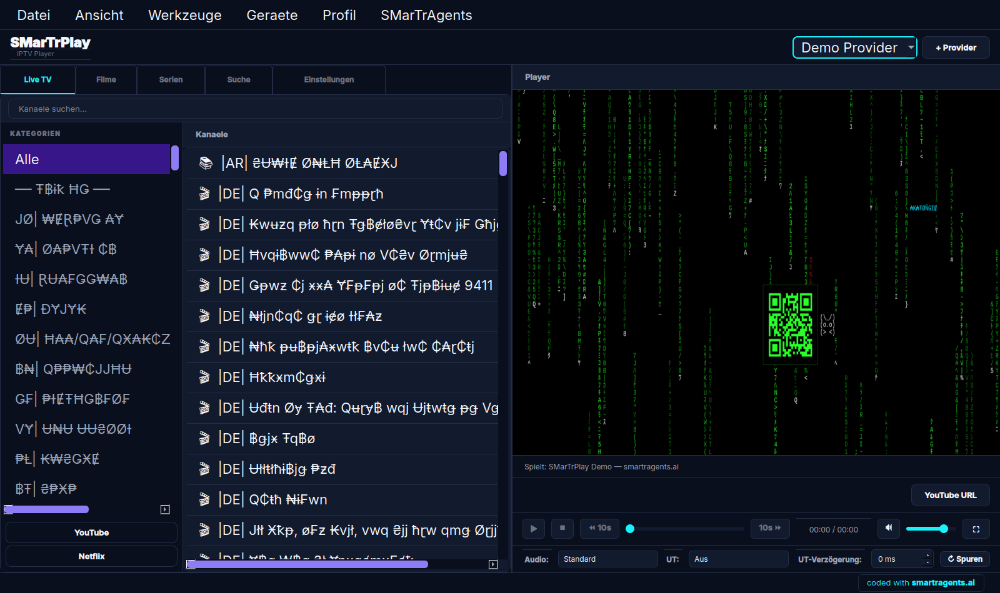
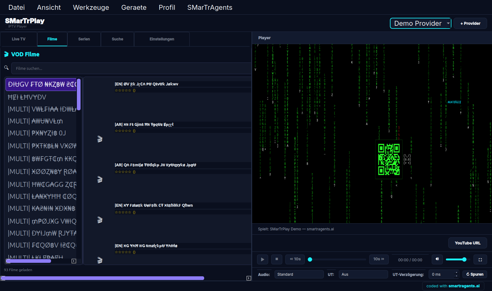
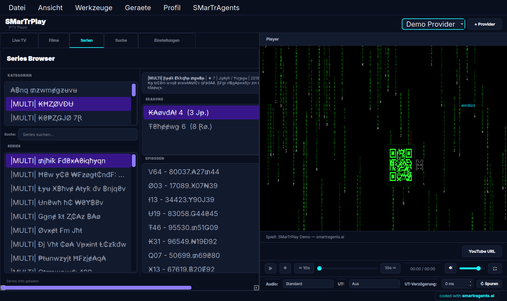

# 📺 SMarTrPlay — Modern IPTV Player


> A modern, feature-rich IPTV player built with Python, PyQt5, and ffplay — featuring Xtream Codes API support, EPG, VOD, Series browsing, DLNA casting, and much more.

---

## 📸 Screenshots

| Live TV | VOD Browser | EPG Timeline |
|---|---|---|
|  |  |  |

| Series Browser | Mini Player | Web Remote |
|---|---|---|
|  |  |  |

---

## ✨ Features

### v1.0.0 — Core Foundation
- 📺 **Live TV** — Stream live IPTV channels with ffplay backend
- 📋 **M3U Playlist Support** — Import and parse M3U/M3U8 playlists
- 🔗 **Xtream Codes API** — Full Xtream Codes panel integration
- 🎨 **SMarTr Brand Design** — Custom dark blue & cyan themed UI

### v2.0.0 — Enhanced Experience
- 📅 **EPG (Electronic Program Guide)** — View program schedules for channels
- ⚙️ **Settings Panel** — Configure player, streams, and UI preferences
- 📚 **Series Browser** — Browse and watch series from your provider
- ⭐ **Favorites** — Mark channels, VOD, and series as favorites for quick access

### v3.0.0 — Power User Features
- 🪟 **Picture-in-Picture (PiP)** — Watch in a floating mini window while browsing
- 💬 **Subtitles** — Load and display subtitle tracks
- ⏺️ **Recording** — Record live streams to local storage
- 🔄 **Auto-Refresh** — Automatically refresh playlists and EPG data
- 📦 **AppImage** — Portable Linux AppImage builds

### v4.0.0 — Advanced & Cast
- 📡 **DLNA / Cast** — Cast streams to DLNA-compatible devices (TVs, speakers)
- 👤 **Multi-Profile** — Manage multiple IPTV providers with seamless switching
- 🖥️ **Mini Player** — Compact floating player widget
- 📊 **EPG Timeline** — Visual timeline view of upcoming programs
- ⏯️ **Catch-up** — Watch previously aired content with catch-up support
- 🌐 **Web Remote** — Control SMarTrPlay from a browser on your phone or tablet
- 📦 **Flatpak & Snap** — Additional Linux package formats
- 🎬 **VOD Browser** — Browse video-on-demand content with metadata, posters, and categories
- 📖 **Series Browser Enhancement** — Improved series browsing with season/episode navigation
- 🔍 **Global Search** — Search across live channels, VOD, and series simultaneously
- 🖱️ **Double-Click Seek** — Double-click on the player to seek forward/backward

---

## 🚀 Installation

### Linux

#### Option A: DEB Package (Debian/Ubuntu)
```bash
sudo dpkg -i SMarTrPlay_v4.0.0_amd64.deb
sudo apt-get install -f  # Install dependencies if needed
```

#### Option B: AppImage
```bash
chmod +x SMarTrPlay_v4.0.0_x86_64.AppImage
./SMarTrPlay_v4.0.0_x86_64.AppImage
```

#### Option C: Flatpak
```bash
flatpak install smartrplay
flatpak run ai.smartragents.SMarTrPlay
```

#### Option D: Snap
```bash
sudo snap install smartrplay
smartrplay
```

### Windows

Download `SMarTrPlay_v4.0.0.exe` from the [Releases](../../releases) page and run the installer.

### From Source

#### Prerequisites
- Python 3.8+
- PyQt5
- ffplay (part of FFmpeg)
- SQLite3

#### Install
```bash
git clone https://github.com/SMartrAgents/SMarTrPlay.git
cd SMarTrPlay
pip install -r requirements.txt
python main.py
```

---

## 📖 Usage

### Adding an IPTV Provider
1. Open SMarTrPlay
2. Go to **Settings → Providers → Add Provider**
3. Choose provider type:
   - **Xtream Codes**: Enter server URL, username, and password
   - **M3U URL**: Paste your M3U playlist URL
   - **Local M3U File**: Browse to a local .m3u file
4. Click **Save** — channels, VOD, and series will be loaded automatically

### Browsing Live Channels
1. Navigate to the **Live TV** tab
2. Browse channels by category or use the search bar
3. Double-click a channel to start streaming
4. Use the player controls for volume, fullscreen, and PiP

### Watching VOD (Video on Demand)
1. Navigate to the **VOD** tab
2. Browse movies by category or search by title
3. Click a movie to see details and poster
4. Press **Play** to start watching

### Watching Series
1. Navigate to the **Series** tab
2. Browse series by category or search
3. Click a series to see seasons and episodes
4. Select an episode and press **Play**

### Configuration & Settings

Access settings via **Settings → Preferences**:

| Setting | Description |
|---|---|
| **Player Backend** | Choose ffplay or external player |
| **Default Volume** | Set startup volume (0–100) |
| **EPG Refresh Interval** | Auto-refresh EPG every N hours |
| **Recording Path** | Directory for recorded streams |
| **Subtitle Language** | Preferred subtitle language |
| **Theme** | Dark (SMarTr default) or Light |
| **PiP Default Size** | Mini player window size |
| **Cast Device** | Default DLNA device |

### Keyboard Shortcuts

| Shortcut | Action |
|---|---|
| `Space` | Play / Pause |
| `F` | Toggle Fullscreen |
| `P` | Toggle Picture-in-Picture |
| `M` | Mute / Unmute |
| `↑` / `↓` | Volume Up / Down |
| `←` / `→` | Seek -10s / +10s |
| `R` | Start / Stop Recording |
| `S` | Toggle Subtitles |
| `C` | Open Cast / DLNA menu |
| `Ctrl+F` | Global Search |
| `Ctrl+D` | Double-click seek (enable/disable) |
| `Esc` | Exit Fullscreen / Close PiP |

---

## 🔧 Build from Source

### Prerequisites
- Python 3.8+
- `pyinstaller` (`pip install pyinstaller`)
- `fpm` (for deb packages: `gem install fpm`)
- `appimagetool` (for AppImage builds)

### Build DEB
```bash
python build.py --target=deb
# Output: build/linux/build_deb/SMarTrPlay_v4.0.0_amd64.deb
```

### Build AppImage
```bash
python build.py --target=appimage
# Output: build/linux/build_appimage/SMarTrPlay_v4.0.0_x86_64.AppImage
```

### Build Windows EXE
```bash
python build.py --target=exe
# Output: build/windows/SMarTrPlay_v4.0.0.exe
```

### Build All
```bash
python build.py --target=all
```

---

## 🛠️ Tech Stack

| Component | Technology |
|---|---|
| **Language** | Python 3.8+ |
| **GUI Framework** | PyQt5 |
| **Media Player** | ffplay (FFmpeg) |
| **Database** | SQLite3 (local cache, favorites, history) |
| **IPTV Protocol** | Xtream Codes API, M3U/M3U8 parsing |
| **Casting** | DLNA / UPnP |
| **Packaging** | PyInstaller, fpm, AppImage, Flatpak, Snap |
| **Design** | SMarTr Brand — Dark Blue (#0A1A2F) & Cyan (#00D9FF) |

---

## 🎨 SMarTr Brand Design

SMarTrPlay features the distinctive **SMarTrAgents brand design**:
- **Primary Color**: Dark Blue `#0A1A2F` — deep, professional background
- **Accent Color**: Cyan `#00D9FF` — vibrant highlights and active states
- **Slate Tones**: `#1E2D3F` / `#2A3D5C` — card surfaces and panels
- **Typography**: Clean sans-serif, optimized for readability on TV screens
- **Minimalist UI**: No clutter, content-first design philosophy

---

## 📄 License

This project is licensed under the **MIT License** — see the [LICENSE](LICENSE) file for details.

---

## 🔗 Links

- 🌐 Website: [smartragents.ai](https://smartragents.ai)
- 📧 Email: akatongie@smartragents.ai
- 💬 Telegram: [@SMartrAgents](https://t.me/SMartrAgents)
- 🐛 Issues: [GitHub Issues](../../issues)
- 📦 Releases: [GitHub Releases](../../releases)

---

<div align="center">

**SMarTrPlay** — Part of the SMarTrAgents ecosystem  
© 2026 SMartrAgents / Karl Heinz Marko

</div>
