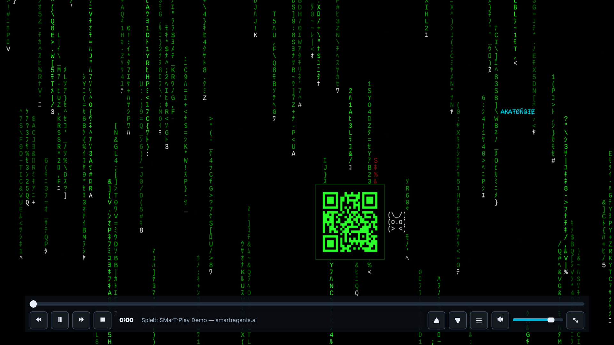
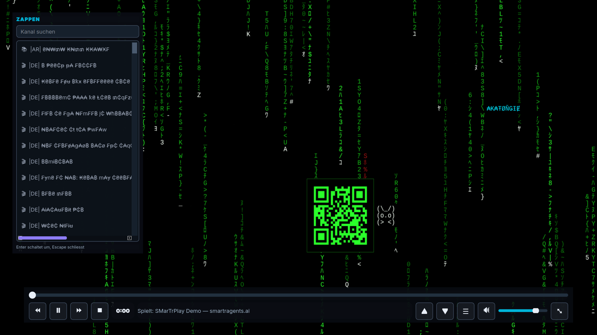
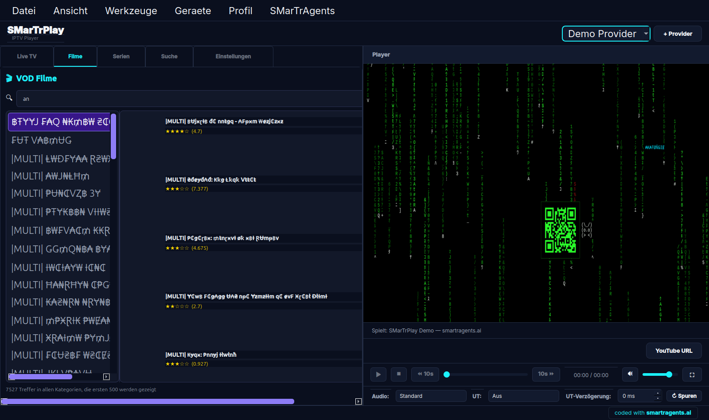

<div align="center">

# 📺 SMarTrPlay — Free Open Source IPTV Player for Windows & Linux

**Xtream Codes · M3U / M3U8 · EPG TV Guide · VOD & Series · VLC Playback · Fullscreen Zapping**

[](LICENSE)
[](https://github.com/SMarTrAgents/smartrplay/releases/latest)
[](https://github.com/SMarTrAgents/smartrplay/releases/latest)
[](https://www.python.org/)
[](https://pypi.org/project/PyQt5/)
[](https://smartragents.ai)

### [⬇️ Download for Windows](https://github.com/SMarTrAgents/smartrplay/releases/latest) · [⬇️ Download for Linux](https://github.com/SMarTrAgents/smartrplay/releases/latest) · [🌐 smartragents.ai](https://smartragents.ai)

</div>

---

> **SMarTrPlay is a free, open source IPTV player** for Windows and Linux. Connect your own
> Xtream Codes account or M3U playlist and watch live TV, movies and series with a real
> program guide — built on **libVLC**, so hardware acceleration, subtitles and audio tracks
> just work. One installer for Windows, one single AppImage file for Linux. No account with
> us, no telemetry, no ads inside the player.

> **SMarTrPlay ist ein kostenloser IPTV-Player mit offenem Quelltext** für Windows und Linux.
> Eigenen Xtream-Codes-Zugang oder M3U-Liste eintragen und Fernsehen, Filme und Serien mit
> echter Programmzeitschrift schauen. Ein Installer für Windows, eine einzige AppImage-Datei
> für Linux. Kein Konto bei uns, keine Datensammlung, keine Werbung im Player.

---

## 📥 Download

| Platform | File | Notes |
|---|---|---|
| **Windows 10 / 11** | [`SMarTrPlay-Setup-x.y.z.exe`](https://github.com/SMarTrAgents/smartrplay/releases/latest) | Installs per user, no admin rights required. Needs [VLC](https://www.videolan.org/vlc/) for playback — the installer offers the download. |
| **Linux (x86_64)** | [`SMarTrPlay-x.y.z-x86_64.AppImage`](https://github.com/SMarTrAgents/smartrplay/releases/latest) | One file, no installation. `chmod +x` and run. Uses your system VLC. |
| **From source** | see [Build from source](#-build-from-source) | Python 3.11+, PyQt5, python-vlc |

```bash
# Linux — three commands and you are watching
wget https://github.com/SMarTrAgents/smartrplay/releases/latest/download/SMarTrPlay-x86_64.AppImage
chmod +x SMarTrPlay-x86_64.AppImage
./SMarTrPlay-x86_64.AppImage
```

---

## ✨ What SMarTrPlay does

### Live TV, movies and series
- **Xtream Codes API** — enter server, username and password, everything loads automatically
- **M3U / M3U8 playlists** — local files and remote URLs
- **EPG program guide** — XMLTV timeline with what is on now and next
- **Movies (VOD)** with cover art, plot, rating and trailer
- **Series** with seasons and episodes, and **episode zapping in fullscreen**
- **Multiple providers** side by side, switch without restarting

### Built for actually watching
- **libVLC playback** — hardware acceleration, subtitles, multiple audio tracks
- **Fullscreen with a real control bar** — double-click the picture to enter and leave,
  the stream keeps running, no restart, no black frame
- **Zapping without leaving fullscreen** — arrow keys switch channel or episode,
  `L` opens a searchable channel list on top of the running picture
- **Master search across every category** — including the ones your provider does not even
  list. On a real account this reached 22 037 series that were unreachable before.
- **Keyboard first** — `F11` fullscreen, `Space` pause, `←` `→` seek, `↑` `↓` zap, `M` mute
- **Large fonts and visible scrollbars** — built with low vision in mind, not as an afterthought

### Quiet where it matters
- **Diagnostics server bound to localhost only**, with a token — never exposed to the network
- **No telemetry**, no account, no phone home
- **SQLite with WAL** for a fast local cache of your own lists

---

## 📸 Screenshots

| Live TV | Movies (VOD) | Series |
|---|---|---|
|  |  |  |

**Fullscreen with the floating control bar** — large buttons, seek bar, channel and episode zapping:



**Zapping without leaving fullscreen** — the channel list floats over the running picture:



**Master search across every category** — 7 527 hits in one go, including categories the
provider does not even list:



> **About these screenshots:** the picture on screen is our own demo image, not a film,
> and every provider, category and channel name is deliberately unreadable. SMarTrPlay is
> shipped and documented without any third party content.
>
> **Zu den Bildern:** Das Bild auf dem Schirm ist unsere eigene Vorlage, kein Film, und
> Anbieter-, Kategorie- und Sendernamen sind bewusst unlesbar gemacht. SMarTrPlay wird ohne
> fremde Inhalte ausgeliefert und gezeigt.

---

## 🚀 Quick start

1. Download and start SMarTrPlay.
2. Open **Settings → Providers → Add**.
3. Enter the server address, username and password **of your own IPTV subscription**, or
   pick an M3U file.
4. The channel, movie and series lists load by themselves. Double-click a channel to watch.
5. Double-click the picture for fullscreen. Arrow keys zap. `L` opens the channel list.

> **You bring your own service.** SMarTrPlay ships no channels, no playlists and no
> credentials. It is a player, like VLC is a player. Use it with a subscription you are
> entitled to use.
>
> **Du bringst deinen eigenen Dienst mit.** SMarTrPlay liefert keine Sender, keine Listen und
> keine Zugangsdaten mit. Es ist ein Abspielprogramm, so wie VLC eines ist. Nutze es mit
> einem Zugang, zu dem du berechtigt bist.

---

## ⌨️ Keyboard shortcuts

| Key | Action |
|---|---|
| `F11` / `F` / double-click | Fullscreen on and off |
| `Esc` | Leave fullscreen |
| `Space` | Pause / resume |
| `←` / `→` | Seek 10 seconds |
| `↑` / `↓` | Previous / next channel — or episode while a series is playing |
| `L` | Channel list on top of the running picture |
| `M` | Mute |
| `+` / `-` | Volume |

---

## 🔧 Build from source

```bash
git clone https://github.com/SMarTrAgents/smartrplay.git
cd smartrplay
python3 -m venv .venv --system-site-packages
.venv/bin/pip install -r requirements.txt
.venv/bin/python src/main.py
```

**Linux AppImage:**
```bash
.venv/bin/pip install pyinstaller
bash build/linux/build-appimage.sh 5.0.0     # → dist/SMarTrPlay-5.0.0-x86_64.AppImage
```

**Windows installer:** built by GitHub Actions
([`build-windows.yml`](.github/workflows/build-windows.yml)) with PyInstaller and Inno Setup.
Push a tag `vX.Y.Z` and both packages are built, tested and attached to the release.

**Requirements:** Python 3.11+, PyQt5, python-vlc, requests — and VLC installed on the system.

---

## 🧪 Quality

Every change is measured against the running window, not against the source code.
The acceptance runs live in [`tests/`](tests/):

| Run | Checks | What it proves |
|---|---|---|
| `abnahme.py` | 20 | Startup, playback, pause, seek, volume, clean shutdown |
| `abnahme-vollbild.py` | 19 | Fullscreen, control bar, zapping, return without losing the picture |
| `abnahme-suche.py` | 14 | Series loading, category coverage, master search |
| `abnahme-serienzappen.py` | 17 | Episodes in the video area, episode zapping, season limits |

---

## 🏢 Built by SMarTrAgents

SMarTrPlay is built and maintained by **[SMarTrAgents](https://smartragents.ai)** — we build
AI agents and automation that actually run in production: telephone agents that answer your
calls, ticket systems, content pipelines and custom agent teams.

**→ [smartragents.ai](https://smartragents.ai)** — see what else we build.

If SMarTrPlay is useful to you, a ⭐ on this repository helps other people find it.

---

## 📄 License

MIT — see [LICENSE](LICENSE).

```
Copyright (c) 2026 SMarTrAgents (smartragents.ai)

SMarTrAgents.ai by ₳K₳ŦØŇǤƗɆ with Fable 5 (Anthropic) — built in partnership.
SMarTrAgents.ai von ₳K₳ŦØŇǤƗɆ mit Fable 5 (Anthropic) — in Partnerschaft gebaut.
```

**English:** MIT licensed. Free to use, change and share, including commercially. SMarTrPlay
contains no copyrighted media and no access to any service.

**Deutsch:** MIT-Lizenz. Frei nutzbar, veränderbar und weitergebbar, auch gewerblich.
SMarTrPlay enthält keine geschützten Inhalte und keinen Zugang zu irgendeinem Dienst.

---

<div align="center">

**[⬇️ Download](https://github.com/SMarTrAgents/smartrplay/releases/latest)** ·
**[🌐 smartragents.ai](https://smartragents.ai)** ·
**[🐛 Report a bug](https://github.com/SMarTrAgents/smartrplay/issues)**

*IPTV player · Xtream Codes player · M3U player · free IPTV player for Windows ·
IPTV player Linux AppImage · open source IPTV player with EPG*

</div>
